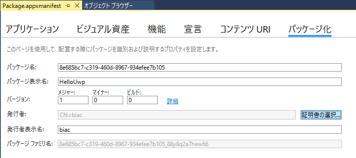
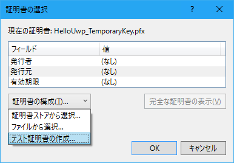
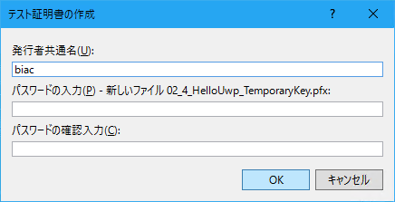

# UWP 101 サンプルコード
これは次の書籍に掲載したサンプルコードの全体です。

**UWP アプリ開発 101 (one oh one) ～ Windows Forms 開発者のための C# / XAML による UWP アプリ開発入門**

* UWP アプリ版: <https://www.microsoft.com/store/apps/9nhbvt8sgkcb>
* Kindle 版: <http://amzn.to/2tbAWdt>

## ビルドするには

次の環境でビルドできることを確認しています。

* Windows 10 Pro. (64bit) build 15063.447
* Visual Studio Community 2017 15.2 (26430.14)
* Windows 10 SDK 10240, 10586, および 14393

## プロジェクト名

書籍のどの部分のサンプルコードなのかを分かりやすくするため、プロジェクト名を書籍とは変えています。  
名前の先頭に 「\_」 で区切って章・節の番号を付けました。

**例**  
08_6_ImageList: 8章6節で完成させた 「ImageList」 プロジェクト

  
## .pfx ファイルはありません

証明書ファイル (拡張子 .pfx) は付属していません。 エラーは出ますが、 ビルド・デバッグ実行に支障はないはずです。

プロジェクトに証明書ファイルを追加したい場合は、以下のようにします。

1. マニフェスト (Package.appxmanifest) を開きます
2. [パッケージ] タブの [証明書の選択] ボタンをクリックします  

3. [証明書の選択] ダイアログで [証明書の構成] ボタンをクリックし、 [テスト証明書の作成] を選びます  

4. [テスト証明書の作成] ダイアログで [OK] ボタンをクリックします (パスワードは設定しなくてもよいです)  

